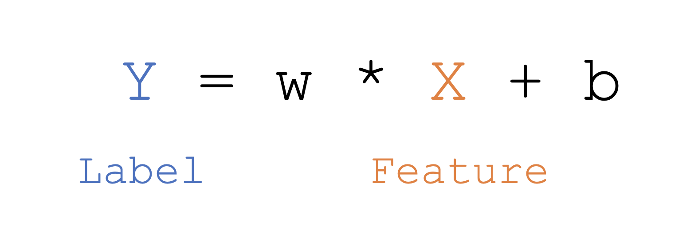
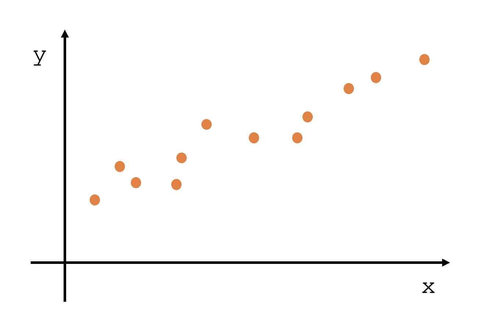
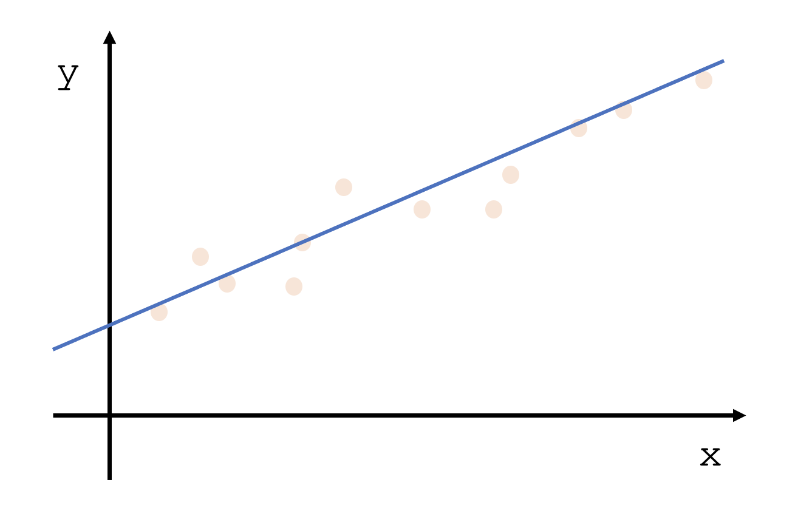
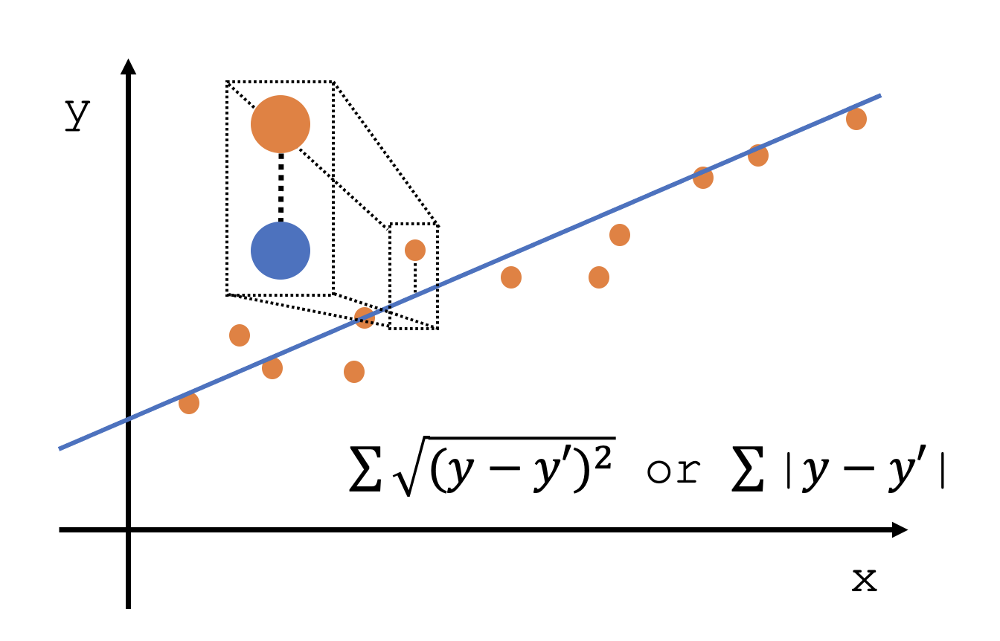

다음 주어진 문제의 공통점은 무엇일까?
- 키에 따른 신발 사이즈
- 시간에 따른 커피 소비량
- 햇빛 노출 시간에 따른 주근깨 개수
- 달 위상에 따른 범죄 수
- 기온에 따른 쇼핑 장바구니의 물품 개수

 

리그레션 알고리즘은 첫번째 포스트에서 설명했듯이 Supervised Learning이고 이에 따라 문제와 정답이 주어진다는 것을 다시 한번 생각하면서 시작한다. 앞서 적은 위 물음 정답은 전부 다 어떤 **특정한 숫자를 예측하는 문제**라는 것이다. 사이즈, 소비량, 개수 이런 것들은 전부 어떤 숫자로 떨어지는 값이다. 이런 문제들을 해결하기 위해서 리그레션 알고리즘을 사용할 수 있다.

 
 
## Simple Regression

지난번 머신러닝을 이해하기 위해서 사용했던 수식이다. Feature에 해당하는 것이 독립 변수, Label에 해당하는 것이 독립변수에 영향을 받는 종속변수이다. 또한 그래프에서 기울기를 의미하는 것이 w이고 x가 0일때 즉, 초기값이 b인 것이다. 이 간단한 식이 바로 Simple Regression이라고 할 수 있다.

 

지난 포스트에서 설명한 것처럼 위와 같은 데이터가 주어졌을 때 어떻게 y=wx+b 라는 식을 구할 수 있을까? 라는 질문이 바로 머신러닝이 해결하고자 하는 것이다. 우리는 저 점들을 모두 다 어느 정도는 만족시켜줄 수 있는 요정도의 그래프를 하나 임의로 그릴 수 있을 것이다.

 

이렇게 그래프가 그려졌을 때 우리는 기울기를 통해 w를, y절편을 이용하여 b를 구하여 y=wx+b 라는 식을 구해낼 수 가 있다. 말은 쉽지만 위 그림처럼 임의로 그려놓은 선이, 기울기가, y절편이 최적의 값일리가 없다. 그렇기 때문에 그것이 가장 중요한 이슈이고 최적의 값을 예측하기 위해서 가장 적절한 기울기와 가장 적절한 b를 계산할 필요가 있는 것이다.

 

우리가 원래 가지고 있던 데이터 값과 모델이 예측한 값을 비교해볼 수 있다. 주황색 점이 우리가 가지고 있던 데이터 값이고 파란색 점이 모델이 예측한 값이다. 당연히 이 차이가 작으면 작을수록 예측을 잘하는 모델이라는 것을 쉽게 알 수 있다. 단 마이너스 값이 나올 것을 고려하여 제곱하고 루트를 씌우거나 절대값을 씌우는 방법을 반드시 사용해야 한다.

 
